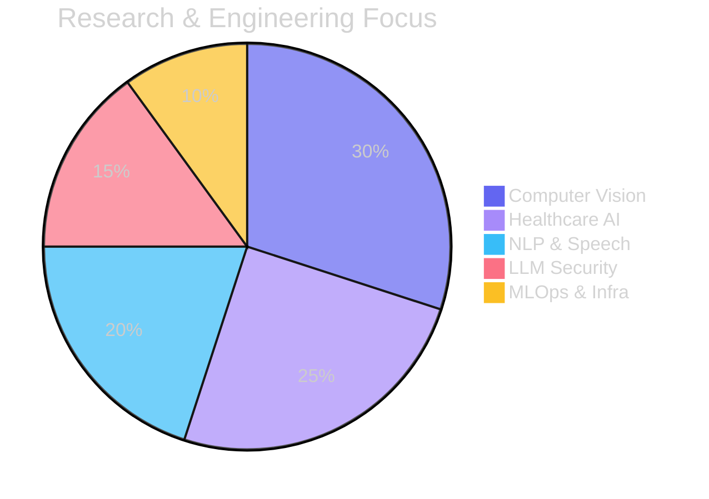
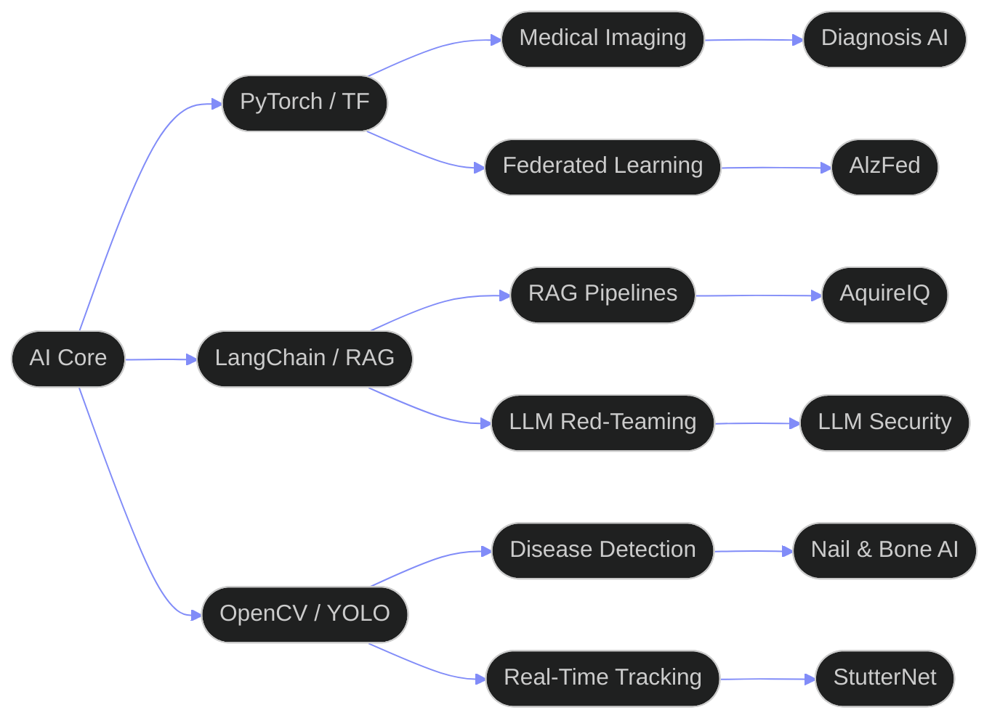
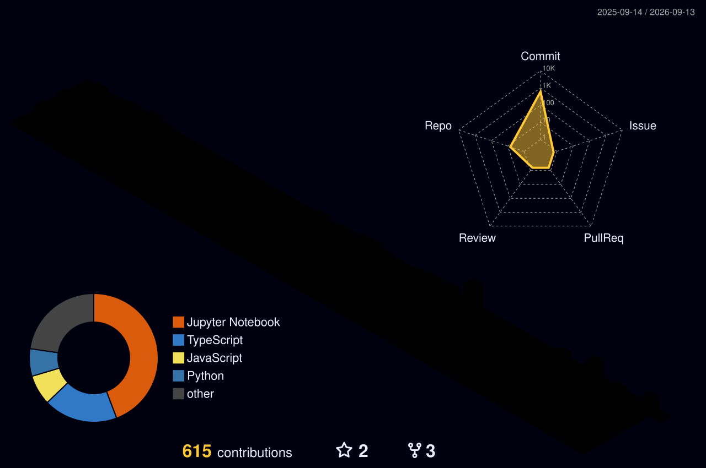

<div align="center">

```
  ╭──────────────────────────────────────────────────────────────────╮
  │                                                                  │
  │   whoami                                                         │
  │   ──────────────────────────────────────────────────────────    │
  │   Abdullah Naeem  ·  AI Engineer & Researcher                    │
  │   FAST NUCES, Data Science  ·  Lahore, Pakistan                 │
  │                                                                  │
  │   cat /focus                                                     │
  │   ──────────────────────────────────────────────────────────    │
  │   Healthcare AI    Computer Vision    Federated Learning         │
  │   LLM Security     Speech NLP         MLOps & Infra             │
  │                                                                  │
  │   ls ~/stack                                                     │
  │   ──────────────────────────────────────────────────────────    │
  │   PyTorch · TensorFlow · HuggingFace · LangChain · OpenCV       │
  │   FastAPI · React · TypeScript · Docker · Kubernetes · AWS      │
  │                                                                  │
  │   echo $STATUS                                                   │
  │   ──────────────────────────────────────────────────────────    │
  │   "Shipping AI that matters — from Pakistan to the world"       │
  │                                                                  │
  │   cat contact.txt                                                │
  │   ──────────────────────────────────────────────────────────    │
  │   github.com/abd84            abdullahnaeem884@gmail.com        │
  │   linkedin.com/in/abdnaeem84  abdullah-naeem-portfolio.vercel.app│
  │                                                                  │
  ╰──────────────────────────────────────────────────────────────────╯
```

<br/>

[](https://git.io/typing-svg)

<br/>

<a href="https://linkedin.com/in/abdnaeem84">
  
</a>&nbsp;
<a href="https://twitter.com/urboyabdlla">
  
</a>&nbsp;
<a href="https://abdullah-naeem-portfolio.vercel.app">
  
</a>&nbsp;
<a href="mailto:abdullahnaeem884@gmail.com">
  
</a>

<br/><br/>


</div>

---

## Identity

<table>
<tr>
<td valign="top" width="55%">

```python
# neural_profile.py

class AbdullahNaeem:
    """
    AI Engineer & Researcher shipping
    products from the heart of Pakistan.
    """
    role       = "AI Engineer & Researcher"
    location   = "Lahore, Pakistan"
    university = "FAST NUCES — Data Science"

    building = [
        "Multimodal Medical Diagnosis AI",
        "Federated Learning for Healthcare",
        "Stuttering Detection NLP Models",
        "LLM Security & Red-Teaming Tools",
        "Computer Vision Systems at Scale",
    ]

    currently  = "Shipping AI products that matter"
    open_to    = ["Research", "Engineering", "Collabs"]

    fun_fact = (
        "Built federated learning for "
        "Alzheimer's detection across "
        "multiple medical institutions"
    )
```

</td>
<td valign="top" width="45%">


<br/>


</td>
</tr>
</table>

---

## Research Distribution

<div align="center">



&nbsp;
&nbsp;
&nbsp;
&nbsp;


</div>

---

## AI Architecture

<div align="center">



</div>

---

## Tech Arsenal

<div align="center">

**[ AI & Machine Learning ]**

[](https://skillicons.dev)

**[ Backend & Infrastructure ]**

[](https://skillicons.dev)

**[ Frontend & Interfaces ]**

[](https://skillicons.dev)

**[ DevOps & Cloud ]**

[](https://skillicons.dev)

**[ Tools & Editors ]**

[](https://skillicons.dev)

<br/>

&nbsp;
&nbsp;
&nbsp;
&nbsp;


</div>

---

## Featured Projects

<div align="center">

| Project | Description | Stack | Status |
|:--------|:------------|:------|:------:|
| **[AquireIQ](https://github.com/abd84/AquireIQ)** | AI intelligence platform with RAG pipeline & smart data acquisition |   |  |
| **[StutterNet](https://github.com/abd84/StutterNet)** | Deep learning stuttering detection for real-time speech therapy assistance |   |  |
| **[AlzFed](https://github.com/abd84/AlzFed)** | Privacy-preserving Alzheimer's detection via federated learning |   |  |
| **[ai-pdf-editor](https://github.com/abd84/ai-pdf-editor)** | Intelligent PDF editor with AI content extraction & RAG capabilities |   |  |
| **[Osteoporosis AI](https://github.com/abd84/Osteoporosis-AI)** | CNN-based X-ray analysis with GRAD-CAM for bone density assessment |   |  |
| **[Adversarial ResNet](https://github.com/abd84/Adversarial-ResNet)** | FGSM/PGD adversarial attacks and defense mechanisms for ResNet |  |  |
| **[LLM Injection](https://github.com/abd84/LLM-Injection)** | Prompt injection taxonomy & defense framework for production LLMs |  |  |
| **[Nail Detection](https://github.com/abd84/Nail-Detection)** | Real-time nail condition CV detection for non-invasive medical diagnostics |  |  |

</div>

---

## GitHub Analytics

<div align="center">


<br/>


</div>

---

## Contribution Activity

<div align="center">


</div>

---

## 3D Contribution Graph

<div align="center">



</div>

---

## Achievements

<div align="center">


</div>

---

## Contribution Snake

<div align="center">

<picture>
  <source media="(prefers-color-scheme: dark)" srcset="./dist/github-contribution-grid-snake.svg"/>
  <source media="(prefers-color-scheme: light)" srcset="./dist/github-contribution-grid-snake.svg"/>
  
</picture>

</div>

---

## Connect

<div align="center">

> *"Building AI systems that bridge the gap between research and real-world healthcare impact."*

<br/>

&nbsp;
&nbsp;
&nbsp;


<br/>

---


</div>
