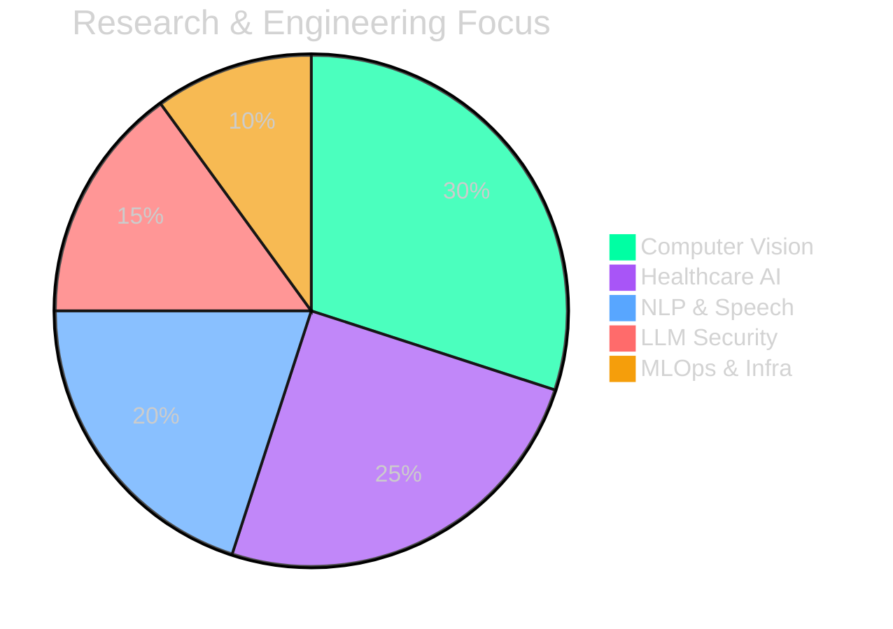
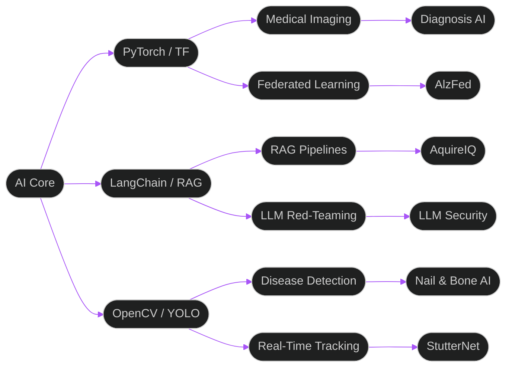

<div align="center">

<!-- ═══════════════════════════════════════════════════════════════ -->
<!--                    ANIMATED HERO HEADER                         -->
<!-- ═══════════════════════════════════════════════════════════════ -->


<br/>


<br/>

<!-- Typing animation -->
[](https://git.io/typing-svg)

<br/>

<!-- Social Links -->
<a href="https://linkedin.com/in/abdnaeem84">
  
</a>&nbsp;
<a href="https://twitter.com/urboyabdlla">
  
</a>&nbsp;
<a href="https://abd84.github.io">
  
</a>&nbsp;
<a href="mailto:abdnaeem84@gmail.com">
  
</a>

<br/><br/>

<!-- Profile metrics -->
&nbsp;
&nbsp;


</div>

---

<!-- ═══════════════════════════════════════════════════════════════ -->
<!--                       IDENTITY                                  -->
<!-- ═══════════════════════════════════════════════════════════════ -->

## ⚡ Identity

<table>
<tr>
<td valign="top" width="55%">

```python
# neural_profile.py

class AbdullahNaeem:
    """
    AI Engineer & Researcher shipping
    products from the heart of Pakistan.
    """
    role       = "AI Engineer & Researcher"
    location   = "Lahore, Pakistan 🇵🇰"
    university = "FAST NUCES — Data Science"

    building = [
        "Multimodal Medical Diagnosis AI",
        "Federated Learning for Healthcare",
        "Stuttering Detection NLP Models",
        "LLM Security & Red-Teaming Tools",
        "Computer Vision Systems at Scale",
    ]

    currently  = "Shipping AI products that matter"
    open_to    = ["Research", "Engineering", "Collabs"]

    fun_fact = (
        "Built federated learning for "
        "Alzheimer's detection across "
        "medical institutions 🧬"
    )
```

</td>
<td valign="top" width="45%">


<br/>


</td>
</tr>
</table>

---

<!-- ═══════════════════════════════════════════════════════════════ -->
<!--                   RESEARCH DISTRIBUTION                         -->
<!-- ═══════════════════════════════════════════════════════════════ -->

## 🔬 Research Distribution

<div align="center">



&nbsp;
&nbsp;
&nbsp;
&nbsp;


</div>

---

<!-- ═══════════════════════════════════════════════════════════════ -->
<!--                  TECHNICAL ARCHITECTURE                         -->
<!-- ═══════════════════════════════════════════════════════════════ -->

## 🏗️ AI Architecture

<div align="center">



</div>

---

<!-- ═══════════════════════════════════════════════════════════════ -->
<!--                     TECH ARSENAL                                -->
<!-- ═══════════════════════════════════════════════════════════════ -->

## 🛠️ Tech Arsenal

<div align="center">

**[ AI & Machine Learning ]**

[](https://skillicons.dev)

**[ Backend & Infrastructure ]**

[](https://skillicons.dev)

**[ Frontend & Interfaces ]**

[](https://skillicons.dev)

**[ DevOps & Cloud ]**

[](https://skillicons.dev)

**[ Tools & Editors ]**

[](https://skillicons.dev)

<br/>

<!-- Specialized tech badges -->
&nbsp;
&nbsp;
&nbsp;
&nbsp;
&nbsp;


</div>

---

<!-- ═══════════════════════════════════════════════════════════════ -->
<!--                   FEATURED PROJECTS                             -->
<!-- ═══════════════════════════════════════════════════════════════ -->

## 🚀 Featured Projects

<div align="center">

| Project | Description | Stack | Status |
|:--------|:------------|:------|:------:|
| **[AquireIQ](https://github.com/abd84/AquireIQ)** | AI intelligence platform with RAG pipeline & smart data acquisition |   |  |
| **[StutterNet](https://github.com/abd84/StutterNet)** | Deep learning stuttering detection for real-time speech therapy assistance |   |  |
| **[AlzFed](https://github.com/abd84/AlzFed)** | Privacy-preserving Alzheimer's detection via federated learning across institutions |   |  |
| **[ai-pdf-editor](https://github.com/abd84/ai-pdf-editor)** | Intelligent PDF editor with AI content extraction & RAG capabilities |   |  |
| **[Osteoporosis AI](https://github.com/abd84/Osteoporosis-AI)** | CNN-based X-ray analysis with GRAD-CAM for bone density assessment |   |  |
| **[Adversarial ResNet](https://github.com/abd84/Adversarial-ResNet)** | FGSM/PGD adversarial attacks and defense mechanisms for ResNet |  |  |
| **[LLM Injection](https://github.com/abd84/LLM-Injection)** | Prompt injection taxonomy & defense framework for production LLMs |  |  |
| **[Nail Detection](https://github.com/abd84/Nail-Detection)** | Real-time nail condition CV detection for non-invasive medical diagnostics |  |  |

</div>

---

<!-- ═══════════════════════════════════════════════════════════════ -->
<!--                    GITHUB ANALYTICS                             -->
<!-- ═══════════════════════════════════════════════════════════════ -->

## 📊 GitHub Analytics

<div align="center">

<table>
<tr>
<td width="50%" valign="top">

</td>
<td width="50%" valign="top">

</td>
</tr>
</table>

</div>

---

<!-- ═══════════════════════════════════════════════════════════════ -->
<!--                  CONTRIBUTION ACTIVITY                          -->
<!-- ═══════════════════════════════════════════════════════════════ -->

## 📈 Contribution Activity

<div align="center">


</div>

---

<!-- ═══════════════════════════════════════════════════════════════ -->
<!--               3D CONTRIBUTION GRAPH                             -->
<!-- ═══════════════════════════════════════════════════════════════ -->

## 🌐 3D Contribution Graph

<div align="center">


</div>

---

<!-- ═══════════════════════════════════════════════════════════════ -->
<!--                   GITHUB TROPHIES                               -->
<!-- ═══════════════════════════════════════════════════════════════ -->

## 🏆 Achievements

<div align="center">


</div>

---

<!-- ═══════════════════════════════════════════════════════════════ -->
<!--                CONTRIBUTION SNAKE                               -->
<!-- ═══════════════════════════════════════════════════════════════ -->

## 🐍 Contribution Snake

<div align="center">

<picture>
  <source media="(prefers-color-scheme: dark)" srcset="./dist/github-contribution-grid-snake.svg"/>
  <source media="(prefers-color-scheme: light)" srcset="./dist/github-contribution-grid-snake.svg"/>
  
</picture>

</div>

---

<!-- ═══════════════════════════════════════════════════════════════ -->
<!--                   LET'S CONNECT                                 -->
<!-- ═══════════════════════════════════════════════════════════════ -->

## 💬 Let's Connect

<div align="center">

> *"Building AI systems that bridge the gap between research and real-world healthcare impact."*

<br/>

**Open to:**

&nbsp;
&nbsp;
&nbsp;


<br/>

---


</div>
