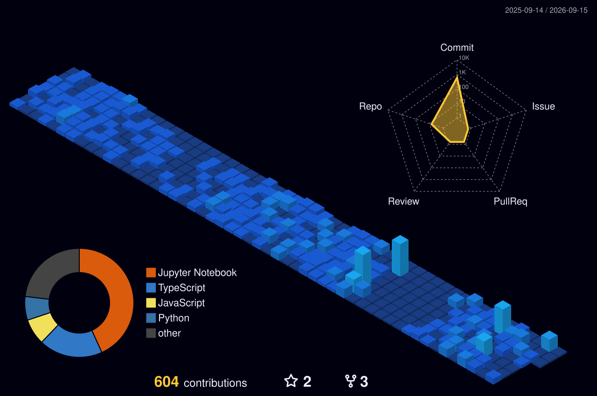
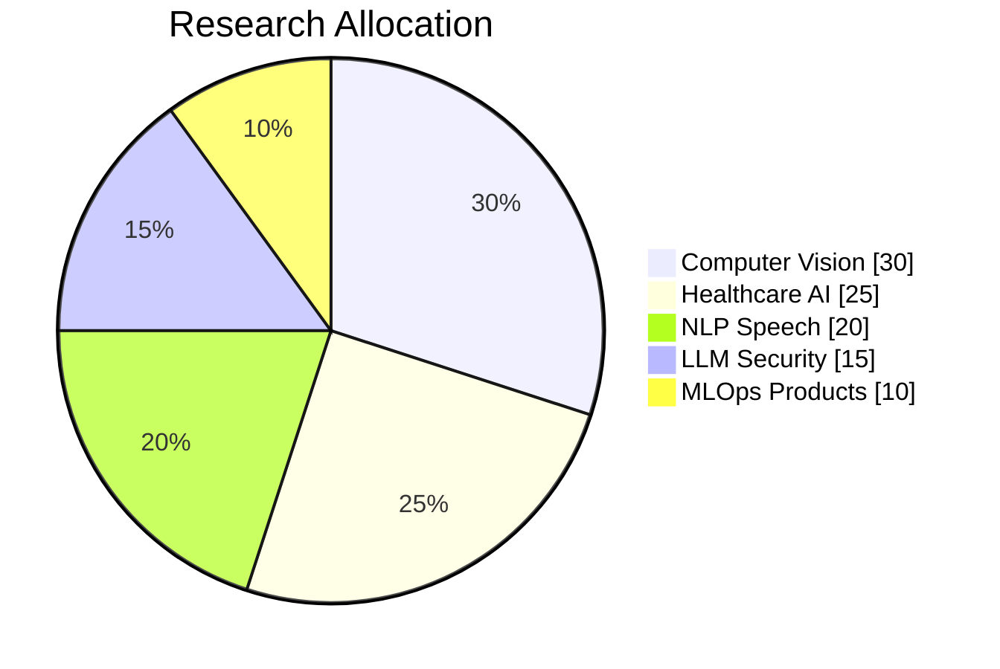

<!-- Abdullah Naeem @abd84 AI Profile -->
<div align="center">


<br/>
<a href="https://abd84.github.io/abd84/"></a>
[](https://www.linkedin.com/in/abdnaeem84/)
[](https://twitter.com/urboyabdlla)
[](https://github.com/abd84/Portfolio-Abdullah-Naeem)

</div>

---

## Neural inference graph
<p align="center"></p>

---

## Interactive AI command center
> Full **3D particle dashboard** with live metrics, terminal boot, orbiting tech stack.
<div align="center">
<h3><a href="https://abd84.github.io/abd84/">OPEN LIVE DASHBOARD</a></h3>
<i>Three.js · animated KPIs · capability matrix · project deck</i>
</div>

---

## Mission control analytics
<div align="center">


</div>

---

## 3D contribution artifact
<p align="center"></p>
<p align="center">
<picture>
<source media="(prefers-color-scheme: dark)" srcset="./profile-3d-contrib/profile-night-view.svg" />
<source media="(prefers-color-scheme: light)" srcset="./profile-3d-contrib/profile-day-view.svg" />

</picture>
</p>
<sub>Run workflow: Actions → GitHub Profile 3D Contrib</sub>

---

## Contribution snake
<p align="center"></p>
<sub>Run workflow: Actions → Generate Snake</sub>

---

## ML production pipeline
<p align="center"></p>

---

## Operator profile
```python
class AbdullahNaeem:
    role = "AI & Data Science Engineer"
    org = "FAST Pakistan"
    status = "shipping AquireIQ + StutterNet"
    domains = ["medical_ai", "adversarial_ml", "federated_learning", "speech_nlp", "llm_security"]
```

<details><summary><b>Capability telemetry</b></summary>

| Domain | Level |
|:-------|:-----:|
| Deep Learning | 94% |
| Medical AI | 88% |
| NLP & Speech | 86% |
| LLM Security | 84% |
| MLOps | 82% |

</details>

---

## Tech stack
<p align="center">

</p>
<p align="center">


</p>

---

## Research matrix
<details open><summary><b>Active 2026</b></summary>

| | Project | Stack |
|:---:|:--------|:-----:|
| 🚀 | [AquireIQ](https://github.com/abd84/AquireIQ) | Python |
| 🎙️ | [StutterNet](https://github.com/abd84/StutterNet-) | TypeScript |
| 🧠 | [AlzFed](https://github.com/abd84/AlzFed) | Jupyter |
| 📄 | [ai-pdf-editor](https://github.com/abd84/ai-pdf-editor) | Python |

</details>

<details><summary><b>Healthcare AI</b></summary>

| | Project |
|:---:|:--------|
| 🦴 | [Osteoporosis Diagnosis](https://github.com/abd84/Multi-Modal-multi-class-Osteoperosis-Osteopenia-Diagnosis-with-Hybrid-Fusion) |
| 🔬 | [CryoET Protein](https://github.com/abd84/CryoET-Protein-Complex-Annotation-Classification) |

</details>

<details><summary><b>Adversarial ML & LLM Security</b></summary>

| | Project |
|:---:|:--------|
| 🎯 | [Adversarial ResNet](https://github.com/abd84/Adversarial-ResNet-Resilience-Gradient-Perturbation-Fidelity-Analysis-) |
| 💉 | [LLM Prompt Injection](https://github.com/abd84/Universal-Prompt-Injection-for-LLMs-Adversarial-Evasion-Response-Manipulation-) |

</details>

---

## GitHub trophies
<div align="center">

</div>

---

## Data science focus


---

## Currently learning
- Agentic AI orchestration
- Production RAG with eval harnesses
- Secure LLM deployments
- Multimodal fusion (2026 patterns)

---

<div align="center">

<b>abd84</b> · turning data into intelligent systems
</div>
